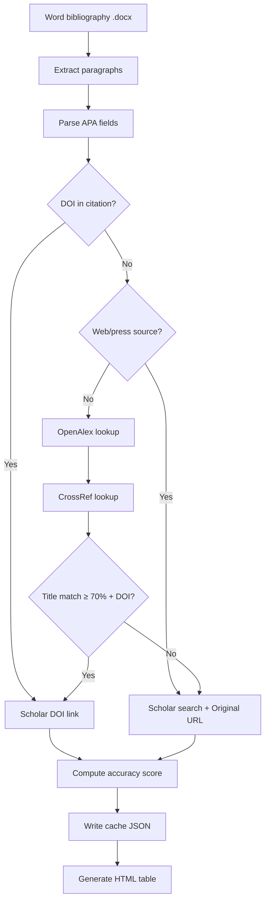

# Bibliography reference verification tool

> **Not published here:** the Word bibliography, interactive HTML table, lookup cache, or any citation text. This page documents the **methodology and implementation** only — for reproducibility and portfolio purposes.

**Document date:** June 2026  
**Build script (local, private):** `WORK/docs/build_scholar_html.py`  
**Full internal process notes:** `WORK/docs/References_PhD_Scholar_Verification_Process.md` (not served publicly)

---

## 1. Problem statement

Convert a Word bibliography (`.docx`, APA-style references) into an **interactive HTML verification table** where:

1. Each reference has a **clickable Google Scholar link** to inspect the publication.
2. Each row includes an **automated accuracy score** estimating link reliability.
3. The reviewer can **manually mark** each row: correct, partial, or wrong.
4. The workflow is **documented and reproducible**.

Typical scale: **hundreds of references** (e.g. 500+ in the project that produced this tool).

---

## 2. Source data

| Property | Description |
|----------|-------------|
| Input format | Microsoft Word (`.docx`) |
| Citation style | Mostly APA 7th (Author, Year. Title. Journal/Publisher…) |
| DOI in text | Often sparse — majority of rows lack an explicit DOI |

### Extraction method

`.docx` files are ZIP archives containing XML. References are extracted by reading `word/document.xml` and concatenating text nodes per paragraph — **no external Word library** required (stdlib `zipfile` + `xml.etree`).

---

## 3. High-level pipeline



---

## 4. Approaches attempted

### 4.1 Direct Google Scholar scraping (`scholarly`)

**Library:** `scholarly` (Python)

**Result:** Worked for individual lookups. Batch runs hit Google Scholar rate limits after ~10 requests (`MaxTriesExceededException`). At ~30 s per reference, a full run would take hours and degrade to fallback URLs.

**Conclusion:** Abandoned as primary mechanism for large bibliographies.

### 4.2 Semantic Scholar API

**Result:** HTTP **429** (Too Many Requests) during batch processing without API key and throttling.

**Conclusion:** Not suitable as primary source at this volume.

### 4.3 Final approach — OpenAlex + CrossRef → DOI → Google Scholar

**Rationale:**

- OpenAlex and CrossRef are **free REST APIs** for bibliographic metadata.
- A matched **DOI** maps to a reliable Scholar query:  
  `https://scholar.google.com/scholar?q=doi:10.xxxx/yyyy`
- When no DOI is found, a **tuned Scholar search URL** still gives a one-click starting point.

---

## 5. Resolution model

For each parsed reference, the script applies this **decision tree**:

### Step 1 — Parse citation fields

| Field | Method |
|-------|--------|
| Authors | Text before `(Year)` |
| Year | Regex on `(YYYY)` or `(YYYYa)` |
| Title | First segment after year, before next `. ` |
| DOI | Regex: `10.\d{4,}/…` or `doi.org/…` |
| Source URL | Last `http(s)://…` in citation |
| Author last name | Last token of first author |
| `is_web` flag | URL + keywords (press release, .gov, Reuters, etc.) |

**APA parse regex (simplified):**

```python
REF_RE = re.compile(r"^(.+?)\s*\((\d{4}[a-z]?)(?:,\s[^)]+)?\)\.\s*(.+)$")
DOI_RE = re.compile(r"(?:doi:\s*|https?://doi\.org/)?(10\.\d{4,}/[^\s\])>,]+)", re.I)
```

### Step 2 — Choose link type

| Priority | Condition | Scholar URL | Method label |
|----------|-----------|-------------|--------------|
| 1 | DOI in citation | `scholar?q=doi:{DOI}` | `doi_citation` |
| 2 | API match ≥ 70% with DOI | `scholar?q=doi:{DOI}` | `doi_found` |
| 3 | Otherwise | `scholar?q="{title}" {last_name} {year}` | `search` |

### Step 3 — Metadata lookup

**OpenAlex** (`GET https://api.openalex.org/works`):

- Query: `{title[:180]} {last_name}`
- Title similarity via normalized `SequenceMatcher`

**CrossRef** (`GET https://api.crossref.org/works`):

- Params: `query.title`, `query.author`, `rows=5`
- Same scoring; pick best of OpenAlex vs CrossRef

**Merge logic:**

1. OpenAlex first; accept if score ≥ 0.82
2. Else CrossRef; pick higher score
3. Accept if ≥ 0.65; prefer ≥ 0.70 before using DOI
4. **Year bonus:** +0.10 when publication year matches (capped at 1.0)
5. **Rate limit:** ~120 ms sleep between API calls

### Step 4 — Accuracy scoring (0–98)

| Score | Label | Condition |
|------:|-------|-----------|
| 98 | Very High (DOI verified) | DOI in citation, match ≥ 95% |
| 92 | High (DOI verified) | DOI in citation, match ≥ 85% |
| 96 | Very High (DOI matched) | DOI from API, title match ≥ 92% |
| 88 | High (DOI matched) | DOI from API, title match ≥ 80% |
| 75 | Medium (DOI matched) | DOI from API, title match ≥ 70% |
| 72 | Medium (search tuned) | Search link, metadata match ≥ 85% |
| 58 | Low-Medium | Search link, metadata match ≥ 70% |
| 42 | Low (search only) | Weak/no metadata |
| 35 | Web/gray literature | Press/web source flagged |

Scores indicate **link reliability**, not whether the original citation text is bibliographically perfect.

---

## 6. Scripts and artifacts (private)

### Build script

**Path:** `WORK/docs/build_scholar_html.py`  
**Dependencies:** Python 3.10+, `requests`; stdlib: `json`, `re`, `zipfile`, `xml.etree`, `difflib`, `urllib`

| Function | Purpose |
|----------|---------|
| `extract_docx_paragraphs()` | `.docx` XML → reference strings |
| `parse_reference()` | APA field extraction + web-source detection |
| `lookup_openalex()` / `lookup_crossref()` | Metadata APIs |
| `resolve_metadata()` | Merge API results |
| `resolve_reference()` | Per-reference resolution + caching |
| `accuracy_from_match()` | Score 0–98 |
| `build_html()` | Interactive HTML table |
| `main()` | Batch orchestration |

Configurable paths at top of script point to **local private files** (input `.docx`, output `.html`, cache `.json`). These are **not deployed** to the public server.

### Lookup cache

JSON file storing resolved URLs, DOIs, scores, and notes so re-runs skip API calls. Delete cache to force full re-lookup.

### Output HTML (private)

Features of the generated page (kept offline):

- Dark-themed responsive table
- Summary statistics
- Filter by text, score, verification status
- Per-row dropdown: Correct / Partial / Wrong
- Progress in browser `localStorage`
- Export verification results to CSV
- Original URL link for web/press sources

---

## 7. Example batch results (aggregate only)

From one successful run on a **511-reference** bibliography:

```json
{
  "total": 511,
  "with_link": 511,
  "doi_citation": 12,
  "doi_found": 280,
  "search": 219,
  "accuracy_90_plus": 247,
  "accuracy_80_plus": 270,
  "accuracy_below_60": 217
}
```

**Runtime:** ~8 minutes with API throttling (vs 4+ hours if scraping Scholar directly).

### Link coverage

| Metric | Count |
|--------|------:|
| Scholar links provided | 511 (100%) |
| DOI-based Scholar links | 292 |
| Search-based links | 219 |
| Web/press sources flagged | 65 |

### Recommended human review

| Score band | Count | Action |
|------------|------:|--------|
| ≥ 90 | 247 | Quick confirm |
| 80–89 | 23 | Spot-check |
| 60–79 | 24 | Manual verify |
| &lt; 60 | 217 | **Priority review** |

---

## 8. How to reproduce (locally)

```bash
pip3 install requests
# Configure DOCX_PATH, OUT_HTML, CACHE_PATH in build_scholar_html.py
cd WORK/docs
PYTHONUNBUFFERED=1 python3 build_scholar_html.py
# Open output HTML locally — do not publish without owner consent
```

To re-run lookups: delete the cache JSON first.

**Export verified results:** mark rows in the HTML UI → **Export verification CSV**.

---

## 9. Limitations

1. **No public Google Scholar batch API** — links are DOI queries or constructed searches, not guaranteed internal Scholar citation IDs.
2. **Books, reports, websites** often lack DOIs → lower scores.
3. **OpenAlex/CrossRef** may return wrong edition (book vs review, preprint vs published).
4. **Merged lines** in Word (two citations on one paragraph) parse as one row.
5. **Automated scores are estimates** — human verification column is authoritative.
6. **API rate limits** — script sleeps between calls; aggressive re-runs may throttle OpenAlex/CrossRef.

---

## 10. AI assistant role

Built in **Cursor Agent mode**:

1. Extracted and counted references from `.docx`.
2. Prototyped `scholarly`, diagnosed Scholar rate limits and Semantic Scholar 429.
3. Designed OpenAlex/CrossRef → DOI → Scholar pipeline.
4. Built interactive HTML with filtering, scoring, CSV export.
5. Ran full batch and produced internal process documentation.

---

*This public page intentionally omits bibliography content, citation examples, and output file links.*
